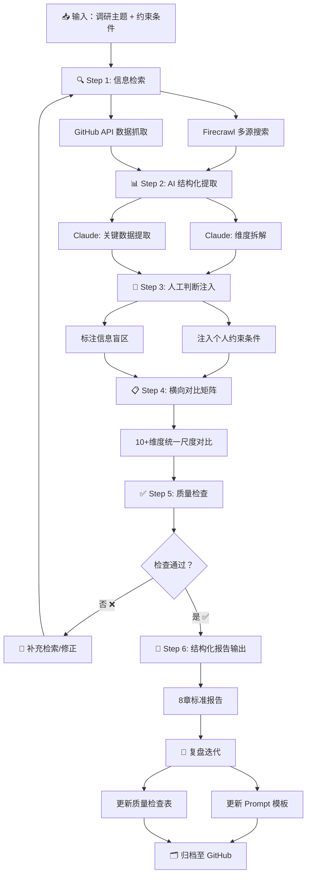

# 工作流流程图

> 戴昊杰 (DEEP007) | 2026.07.05 | Task 003

---

## Mermaid 流程图



---

## 各环节详细说明

| 环节 | 输入 | 处理 | 输出 | 人工参与 |
|------|------|------|------|---------|
| **Step 1: 信息检索** | 调研主题 + 候选列表 | Firecrawl 多源搜索 + GitHub API 抓取 | 原始信息集合（网页、README、issues、社区讨论） | 指定搜索关键词 |
| **Step 2: AI 结构化提取** | 原始信息集合 | Claude 按标准维度拆解、提取关键数据 | 结构化分析草稿 | 确认维度是否合理 |
| **Step 3: 人工判断注入** | 结构化分析草稿 | 我注入个人约束条件 + 标注盲区 | 含判断的分析稿 | **核心环节，全人工** |
| **Step 4: 横向对比矩阵** | 含判断的分析稿 | Claude 生成 10+维度对比表 | 对比矩阵 | 核对数据准确性 |
| **Step 5: 质量检查** | 完整报告草稿 | 按检查表逐项核查 | 通过/需修正 + 具体问题 | 逐项判断 |
| **Step 6: 结构化输出** | 通过检查的报告 | 按输出模板格式整理 | 8章标准化报告 | 最终审核 |

---

## ASCII 备用图（在无法渲染 Mermaid 的环境中使用）

```
+---------------------------+
| 输入：调研主题 + 约束条件   |
+------------+--------------+
             |
             v
+---------------------------+
| Step 1: 信息检索           |
| Firecrawl搜索 + GitHub API |
+------------+--------------+
             |
             v
+---------------------------+
| Step 2: AI 结构化提取       |
| Claude: 维度拆解 + 数据提取 |
+------------+--------------+
             |
             v
+---------------------------+
| Step 3: 人工判断注入  ⭐    |
| 约束条件 + 偏好 + 盲区标注  |
+------------+--------------+
             |
             v
+---------------------------+
| Step 4: 横向对比矩阵        |
| 10+维度统一尺度对比         |
+------------+--------------+
             |
             v
+---------------------------+
| Step 5: 质量检查           |<---+
| 逐项检查 → 通过/修正        |    |
+------------+--------------+    |
             |                    |
       通过? 否 → 补充检索 -------+
             |
            是
             |
             v
+---------------------------+
| Step 6: 结构化报告输出      |
| 8章标准 Markdown 报告      |
+------------+--------------+
             |
             v
+---------------------------+
| 复盘迭代                   |
| 更新Prompt + 检查表 + 归档  |
+---------------------------+
```

## 流程关键决策点

1. **Step 1→2 决策：搜索够了吗？**
   - 标准：是否覆盖了所有候选的 GitHub README、官网文档、至少 2 篇第三方对比文章
   - 不足则回到 Step 1 补充检索

2. **Step 3→4 决策：我的判断够具体吗？**
   - 标准：每个候选是否都有"我认为适合/不适合我的原因"
   - 不够则在 Step 3 继续补充

3. **Step 5 决策：质量检查通过吗？**
   - 标准：10 项检查全部通过
   - 不通过则追溯具体环节修正（回到 Step 1/2/3/4 都有可能）

4. **复盘决策：模板需要更新吗？**
   - 标准：测试中暴露的新问题是否被 Prompt 模板/检查表覆盖
   - 未覆盖则更新对应模板版本
